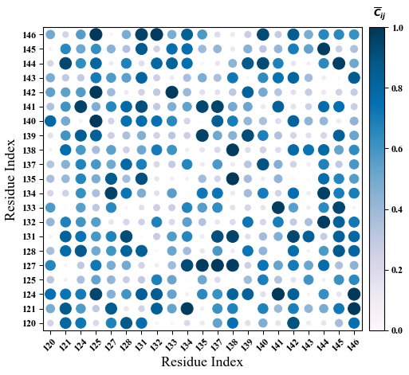

## Correlation Plot Visualization

Most of the known corr_plot functions take raw data as input in order to visualize
correlation matrix, which might be very time consuming with big data. Thus, I have decided
to make my one function that takes already prepared correlation matrix an makes visualization
very fast. In addition, code is very simple, one can easyly customize it based on need.

Function is built with matplotlib library under Python3.5. It takes corr. matrix as 2d np.array
and axis labels as list.


```python
import numpy as np
import matplotlib.pyplot as plt
%matplotlib inline
```


```python
labels = [ '120','121','124','125','127','128','131',
           '132','133','134','135','137','138','139',
           '140','141','142','143','144','145','146']
data = np.random.rand(len(labels),len(labels))
axis_lab = 'Residue Index'
```


```python
from CorrPlot import CPlot
fig = plt.figure(num=None, figsize=(8.636,7), facecolor='w')
CPlot(corr_mat = data, axis_labs = labels, cmap='PuBu', pad = 0.1, rad = 230*data, xlab = axis_lab, ylab=axis_lab)
```


